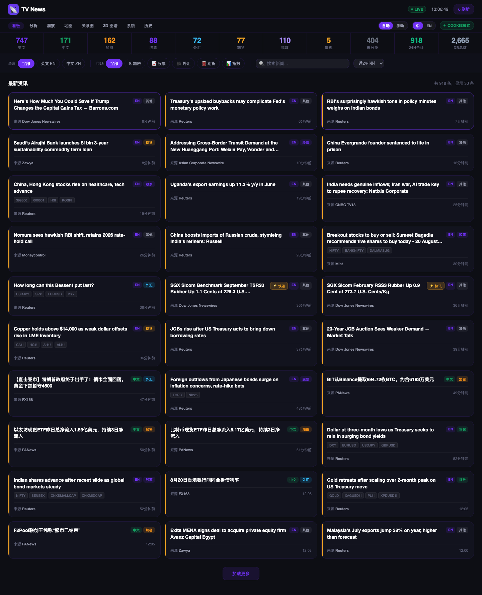
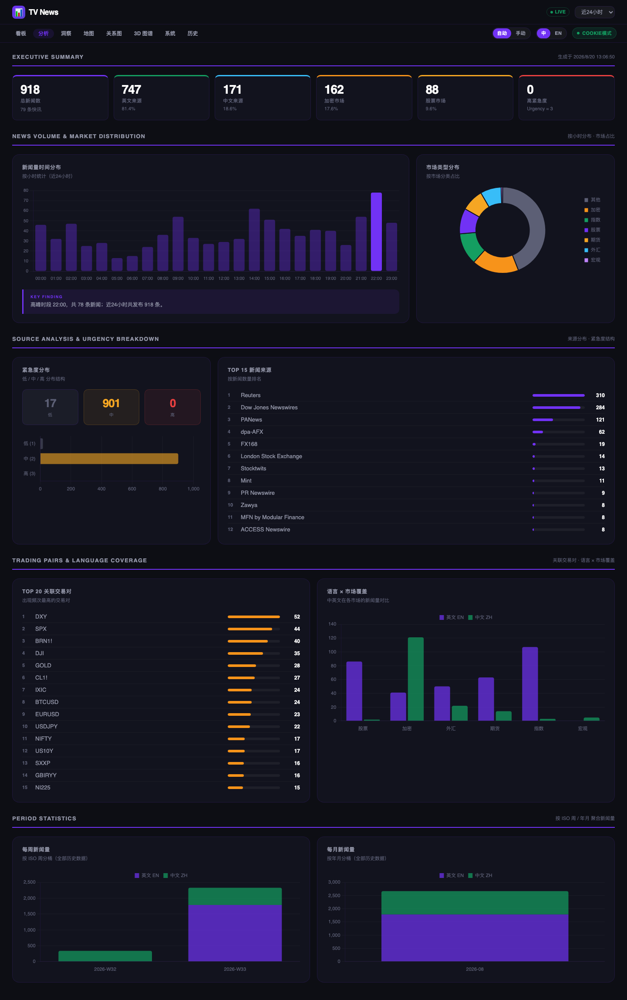
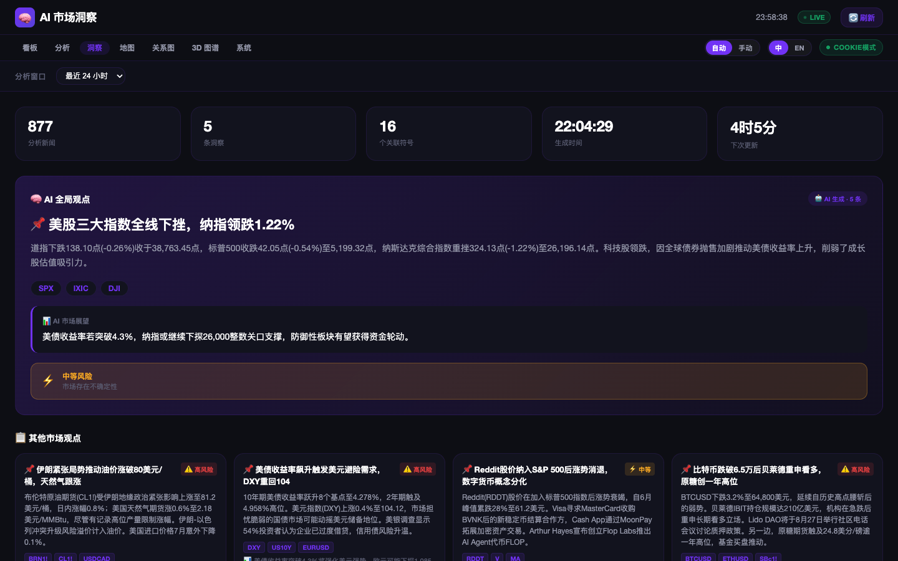
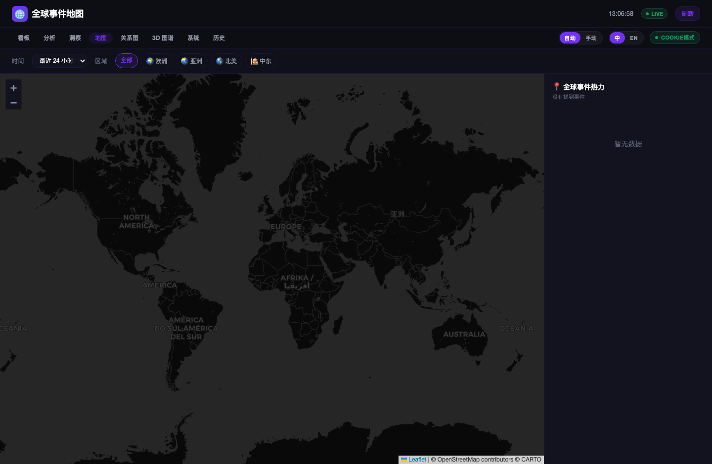
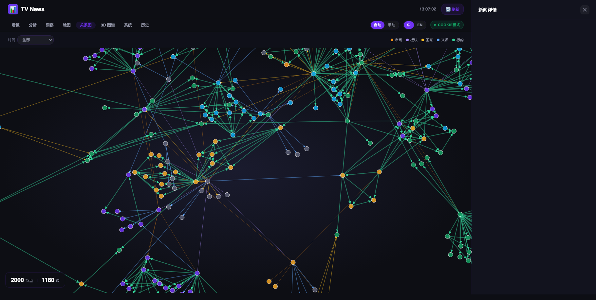
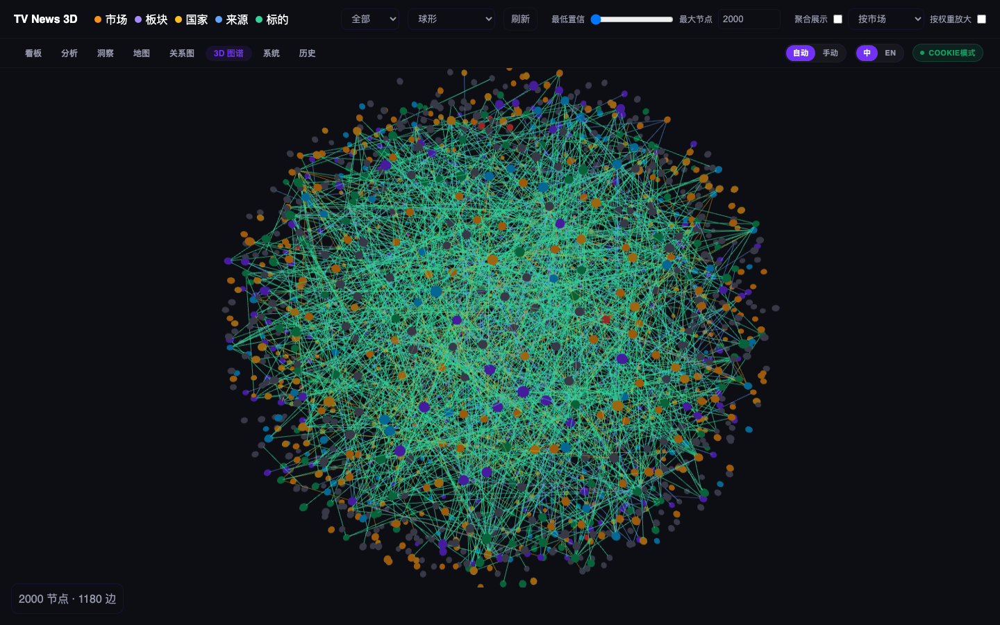
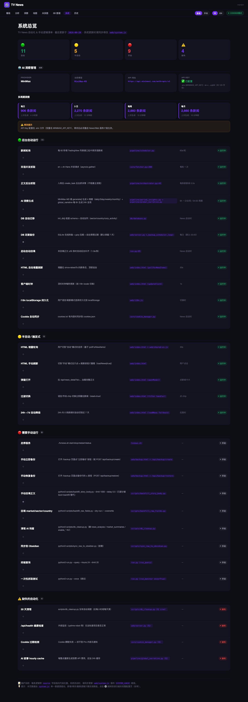
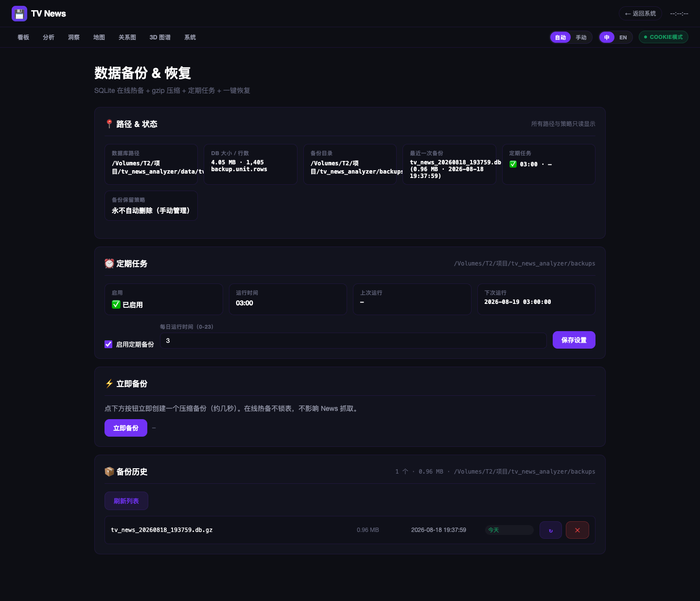
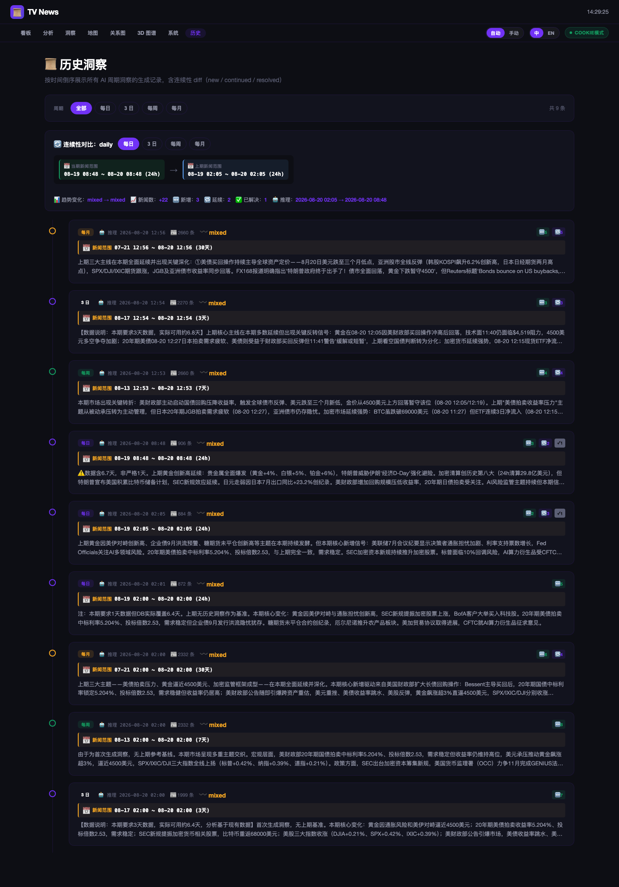
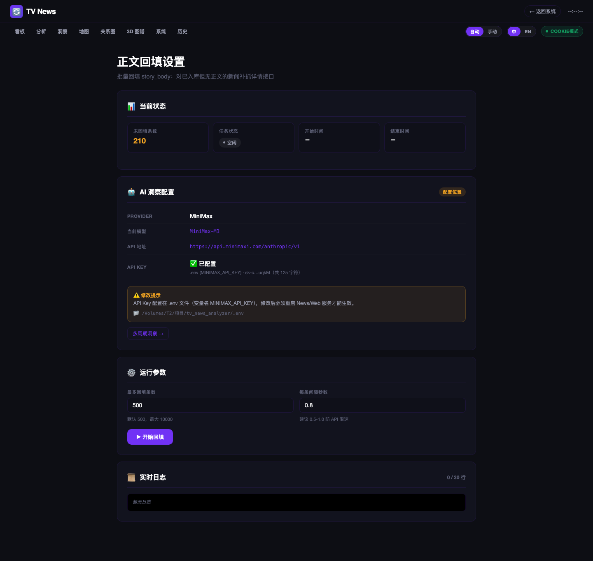

# TradingView News Monitor

> 实时抓取 TradingView 双语新闻，SQLite 落库，终端彩色展示 + Web 看板 + 数据分析页 + 事件关系图 + 3D 图谱 + **AI 双体系洞察（周期 + 全局叙事）**。


---

## 📸 界面预览

### 🏠 看板（首页）



### 📊 数据分析（麦肯锡风格）



### 🕒 AI 市场洞察（时间线 + 4 周期 tab + 全局叙事）



### 🗺️ 全球事件地图



### 🕸️ 关系图谱



### 🌀 3D 图谱（1404 节点 / 723 边）



### 🛠️ 系统总览（含 AI 管理 + 多周期洞察状态）



### 💾 数据备份 & 恢复（手动管理）



### 📜 AI 洞察历史（4 周期筛选 + 连续性对比）



### ⚙️ 回填参数 + AI 洞察配置



---

## ✨ 功能特点

### 数据采集

| 模块 | 说明 |
|------|------|
| 🌍 **双语并发抓取** | 同时抓取英文（`en`）和中文（`zh-Hans`），每轮最多 600 条，支持匿名运行 |
| 🔄 **增量轮询** | 记录上次最新时间戳，只返回新条目，nonce 参数绕过 CDN 缓存 |
| 📰 **正文抓取** | 详情接口获取完整正文（AST → 纯文本），后台异步，不阻塞显示 |
| 🧠 **市场自动推断** | 三级推断（交易所前缀 → 提供商名称 → 标题关键词），覆盖 crypto/stock/forex/futures/index/economic |
| 💾 **本地优先** | SQLite 存储，无云端依赖；数据完全在你自己的机器上 |
| 🔐 **登录态可选** | `data/cookies.txt` 有内容时启用 Cookie 模式；空白时自动匿名降级 |

### Web 看板（9 个页面，统一暗色 Kraken 风格）

| 页面 | 功能 |
|------|------|
| 🏠 `/` | 新闻看板（实时过滤 + 全文弹窗） |
| 📊 `/analytics` | 麦肯锡风格数据分析（时间分布/来源/市场占比） |
| 🕒 `/timeline` | **AI 洞察页**（4 周期 tab + 全局叙事 + 跨事件关联网络） |
| 🗺️ `/map` | 全球事件地图（地理分布） |
| 🕸️ `/graph` | 关系图谱（事件/市场/标的） |
| 🌀 `/graph3d` | 3D 图谱（1404 节点 / 723 边） |
| 🛠️ `/system` | 系统总览 + **AI 配置 + 多周期洞察状态** |
| 💾 `/backup` | 数据备份 & 恢复（手动管理，**永不自动删除**） |
| ⚙️ `/config/backfill` | 回填参数 + **AI 洞察配置（只读）** |
| 📜 `/history` | **AI 洞察历史时间线**（4 周期筛选 + 连续性对比） |

### 🧠 AI 洞察双体系（v1.1.0 新增）

项目维护**两套完全隔离**的 AI 体系，避免相互干扰：

| 体系 | 数据源 | 刷新频率 | 输出 |
|---|---|---|---|
| **AI 周期洞察** | 1d / 3d / 7d / 30d 范围 | 每天 04:00（4 个 period 一次跑） | summary + 5-10 themes + 3-6 多空板块（带 status: new/continued/resolved） |
| **AI 全局叙事** | 过去 24h 跨区域关联 | 每 6h 一次 | 5 个 viewpoint + 5 条 insight（24h summary + 6h detail） |

**两套体系的核心硬规则**：
- ⏰ **时间戳注入**：每条新闻进 AI 都有 `[MM-DD HH:MM · X小时前]` 标记，AI 引用数字时锚定到具体新闻时间
- 📚 **历史 context**：生成时拉前 N 个同周期历史（period: daily=3, 3day/weekly/monthly=2；global: 3 个），AI 显式标注"延续/反转/已解决"
- 🛡️ **完全隔离**：周期洞察和全局叙事**各自独立的 prompt + 独立的历史表 + 独立的 API**，互不干扰
- 💾 **历史可查**：所有生成 append 到 history 表，永久保留，可在 `/history` 页面追溯

**示例输出（v3 实际生成）**：
> 📌 美财政部干预债市，美元创三月新低，黄金退守4500
> summary: 延续上次"美债买盘回升缓解恐慌"叙事，但最新6h出现反转：[08-20 12:14]美元跌至三个月新低...[08-20 12:05]黄金回吐两个多月新高涨幅...Reuters评论'Bonds bounce on US buybacks, but relief may be brief'暗示干预效果存疑

### 🛡️ 数据保护

- `db/database.py:init_db()` 严格幂等（`CREATE TABLE IF NOT EXISTS` + 列存在性检查）
- 全代码 grep `DELETE FROM raw_news` = **0 命中**
- 备份策略：所有备份**永不自动删除**，由你在 `/backup` 页面手动管理
- `.env` 中的 `MINIMAX_API_KEY` **绝不上传**（API 响应也只回传 mask 后的 `sk-c…uqkM`）

---

## 🚀 快速开始

### 一键初始化（推荐）

```bash
git clone https://github.com/zwm521gmailcom/tv-news-analyzer.git
cd tv-news-analyzer

# 一键幂等初始化：建目录 + 建表 + 迁移 + 占位文件
bash scripts/init.sh

# 安装依赖
pip install -r requirements.txt

# 启动 News + Web
bash tvnews.sh start

# 打开浏览器
open http://localhost:5888/
```

> `scripts/init.sh` 是**幂等**的——重复运行不会删任何数据。已存在的 DB / 表 / 行全部保留。详见 `bash scripts/init.sh --help`。

### 手动步骤

```bash
# 1. 安装依赖
pip install -r requirements.txt

# 2. 复制配置
cp .env.example .env
# 编辑 .env（最少配置 TV_FETCH_LANGS 和 HTTP_PROXY）

# 3. 启动
chmod +x tvnews.sh
./tvnews.sh start

# 状态 / 停止 / 重启
./tvnews.sh status
./tvnews.sh stop
./tvnews.sh restart
```

启动后浏览器打开：

| 路由 | 页面 |
|------|------|
| http://localhost:5888/ | 新闻看板（暗色风格 + 全文弹窗） |
| http://localhost:5888/analytics | 数据分析页（麦肯锡风格） |
| http://localhost:5888/timeline | **AI 洞察**（4 周期 tab + 全局叙事 + 跨事件网络） |
| http://localhost:5888/map | 地图页（地理分布） |
| http://localhost:5888/graph | 关系图谱 |
| http://localhost:5888/graph3d | 3D 图谱 |
| http://localhost:5888/system | 系统总览 + AI 配置 + 多周期状态 |
| http://localhost:5888/backup | 数据备份 & 恢复（手动管理） |
| http://localhost:5888/config/backfill | 回填参数 + AI 洞察配置 |
| http://localhost:5888/history | **AI 洞察历史时间线** |

### 历史数据回填（首次运行后）

```bash
# 正文回填（首次启动后跑，对历史数据补抓全文）
python3 scripts/backfill_story_body.py --limit 2700 --delay 0.3

# 字段回填（从 raw_json 推 market / sector / country）
python3 scripts/backfill_raw_fields.py --dry-run   # 预演
python3 scripts/backfill_raw_fields.py --overwrite # 正式写回
```

### 终端查询

```bash
# 最近 24 小时新闻
python3 run.py --query

# 按语言 + 市场过滤
python3 run.py --query --lang zh-Hans --market crypto --limit 30

# 按交易对搜索
python3 run.py --query --symbol BTCUSDT --limit 10

# 单次抓取（测试用）
python3 run.py --once
```

---

## 📁 目录结构

```
tv-news-analyzer/
├── run.py                      # 终端入口（轮询 + 查询）
├── tvnews.sh                   # 一键启动脚本（start/stop/status/restart）
├── scripts/
│   └── init.sh                 # 幂等初始化（建目录 + 建表 + 迁移）
├── DESIGN.md                   # 设计系统规范
├── .env.example                # 配置模板（不含敏感信息）
├── requirements.txt
│
├── config/settings.py          # 全部常量（从 .env 加载）
├── core/                       # fetcher / cookie_manager / rate_limiter / ws_fetcher / minimax_client
├── db/                         # models / database（init_db 幂等迁移） / repository
├── pipeline/                   # orchestrator / scheduler / global_narrative / period_insights
├── display/console.py          # rich 终端输出
├── web/                        # Flask API + 9 个页面（index/analytics/timeline/map/graph/graph3d/system/backup/config_backfill/history）
│
└── scripts/
    ├── init.sh                 # 幂等初始化
    ├── backfill_story_body.py  # 正文回填
    ├── backfill_raw_fields.py  # 字段回填
    ├── sync_to_obsidian.py     # 同步到 Obsidian
    └── sync_raw_to_obsidian.py
```

---

## 🛡️ 数据保护

**重要：你的数据不会被本项目破坏，也不会被推到 GitHub。**

| 路径 | 是否进 git | 说明 |
|------|----------|------|
| `data/tv_news.db` | ❌ | SQLite 数据库（你抓取的所有新闻） |
| `data/cookies.txt` | ❌ | TradingView 登录凭证 |
| `data/cookies.json` | ❌ | Cookie 缓存（自动生成） |
| `backups/*.db.gz` | ❌ | 手动备份的数据库压缩包 |
| `logs/*.log` | ❌ | 运行日志 |
| `.env` | ❌ | 本地配置（含代理、API key） |
| `.env.example` | ✅ | 模板（无敏感信息） |
| `data/.gitkeep` 等 | ✅ | 占位文件（让空目录可被 git 跟踪） |

完整规则见 [`.gitignore`](.gitignore)。

**程序不删除你的数据**：
- `db/database.py:init_db()` 严格幂等（`CREATE TABLE IF NOT EXISTS` + 列存在性检查）
- 全代码 grep `DELETE FROM raw_news` = **0 命中**
- 备份策略：所有备份**永不自动删除**（保留策略已禁用），由你在 `/backup` 页面手动管理

---

## 🔐 隐私与安全

**你的凭证不会被本项目推到 GitHub。**

`.gitignore` 严格排除以下敏感文件：

| 文件 | 风险 | 已排除 |
|------|------|------|
| `.env` | 你的 `MINIMAX_API_KEY` + TradingView cookies + 代理 | ✅ |
| `data/cookies.txt` | TradingView 登录凭证（sessionid / device_t / sp 等） | ✅ |
| `data/cookies.json` | Cookie 缓存（自动生成） | ✅ |
| `data/*.db` | SQLite 数据库（含你抓取的所有新闻） | ✅ |
| `backups/*.db.gz` | 手动备份的数据库压缩包 | ✅ |
| `logs/*.log` | 运行日志（可能含 URL / cookie） | ✅ |

**代码审计结果**（最近一次 commit `42cdeee`）：
- ✅ 真实 `MINIMAX_API_KEY`（`sk-cp-8sE86de...`）在所有 git 历史 = **0 命中**
- ✅ 真实 TradingView sessionid 在所有 git 历史 = **0 命中**
- ✅ `tests/` 中的 cookie 字段都是 fake fixture（`abc123` / `xyz789`）
- ✅ Release assets 只含 10 张 PNG 截图（无 .env / .db / .log）
- ✅ API key 在 Web UI 中只显示 mask 形式（`sk-c…uqkM` 共 125 字符）

**`.env.example` 是干净的占位符模板**，所有真实值都从你的本地 `.env` 读取，**永远不会**出现在仓库里。

**如果你怀疑 key 泄露了**：
1. 立即去 [MiniMax 控制台](https://api.minimaxi.com) 轮换 API key
2. 重新登录 TradingView 刷新 cookies
3. `git log --all -p | grep "sk-cp-"` 验证历史 commit 没泄露（应该 0 匹配）

---

## ⚙️ 配置说明（.env）

### 核心开关

| 变量 | 默认值 | 说明 |
|------|--------|------|
| `FETCH_STORY_BODY` | `false` | `true` 时每条新文章额外请求详情接口获取正文全文 |

### 新闻来源

| 变量 | 默认值 | 说明 |
|------|--------|------|
| `TV_FETCH_LANGS` | `en,zh-Hans` | 并发抓取的语言列表（逗号分隔） |
| `TV_FILTER_LANG` | `en` | 向后兼容单语言模式 |
| `TV_FILTER_SYMBOLS` | 空 | 按交易对过滤，如 `BINANCE:BTCUSDT` |
| `TV_FILTER_MARKETS` | `bond,corp_bond,crypto,economic,etf,forex,futures,index` | 市场类型白名单 |
| `TV_FILTER_CORP_ACTIVITIES` | 空 | 企业活动：`earnings` `ipo` `dividends` 等 |
| `TV_FILTER_ECONOMIC_CATEGORIES` | 空 | 宏观：`gdp` `labor` `trade` `money` 等 |
| `TV_FILTER_PROVIDERS` | 空 | 提供商白名单 |

### 轮询 & 存储

| 变量 | 默认值 | 说明 |
|------|--------|------|
| `data/cookies.txt` | 空 | 唯一的手动 Cookie 输入文件 |
| `HTTP_PROXY` | 空 | 代理，如 `http://127.0.0.1:7890` |
| `ENABLE_PRICE_TRACKER` | `false` | WebSocket 实时价格（需有效 Cookie） |
| `TV_PRICE_SYMBOLS` | `BTC/ETH/SOL/BNB/XRP` | 实时价格订阅列表 |

### AI 洞察（v1.1.0+）

| 变量 | 默认值 | 说明 |
|------|--------|------|
| `MINIMAX_API_KEY` | 空 | MiniMax API key（v1.1+ 唯一 AI 提供方） |
| `MINIMAX_BASE_URL` | `https://api.minimaxi.com/anthropic/v1` | MiniMax Anthropic 兼容端点 |
| `MINIMAX_MODEL` | `MiniMax-M3` | 默认模型 |

> API key 配置在 `.env` 后**必须重启 News + Web 服务**才能生效。Web 端的 `/system` 和 `/config/backfill` 页面会显示当前生效的配置（key 仅显示 mask 后的 `sk-c…uqkM`）。

---

## 🏗️ 系统架构

### 数据采集流程

```
python3 run.py
│
├─ init_db()                  从 DB 恢复上次时间戳（重启不重抓历史）
└─ asyncio.gather()
    │
    ├─ _poll_loop（每 60s）
    │   ├─ fetch_all_langs()          lang:en + lang:zh-Hans 并发请求
    │   ├─ 增量过滤：只返回 published > 上次时间戳
    │   ├─ 去重（INSERT OR IGNORE）
    │   ├─ 立即 show_raw()
    │   └─ create_task(抓正文)        后台异步，每条间隔 0.5s
    │
    └─ _price_loop（可选，WebSocket）
        └─ 订阅实时价格
```

### Web 端

```
Flask (port 5888)
├── /api/* (JSON)
│   ├── /api/stats                  整体统计
│   ├── /api/news                   分页新闻
│   ├── /api/news_detail            单条详情（含 story_body）
│   ├── /api/analytics              分析数据
│   ├── /api/runtime                运行态（匿名 / Cookie）
│   ├── /api/backup/*               备份 & 恢复
│   ├── /api/system                 系统总览
│   ├── /api/system/ai_status       AI 配置 + 多周期洞察状态（v1.1）
│   ├── /api/insights/period        读 4 周期洞察（v1.1）
│   ├── /api/insights/generate      强制重生成（v1.1）
│   ├── /api/insights/history       周期洞察历史（v1.1）
│   ├── /api/insights/compare       周期洞察对比（v1.1）
│   ├── /api/global_narrative       全局叙事（v1.1：含 6h/24h 双窗口 + history context）
│   ├── /api/global_narrative/history  全局叙事历史（v1.1）
│   └── /api/config/*               配置
└── /* (HTML)
    ├── /                           看板
    ├── /analytics                  分析
    ├── /timeline                   AI 洞察（4 周期 + 全局叙事）
    ├── /map                        地图
    ├── /graph                      关系图
    ├── /graph3d                    3D
    ├── /system                     系统总览 + AI 配置
    ├── /backup                     备份
    ├── /config/backfill            回填参数 + AI 配置
    └── /history                    AI 洞察历史时间线
```

---

## 🗄️ 数据库结构

`raw_news` 是“TradingView 原始字段 + 本地派生字段”的混合表。它只保存接口返回的内容及其派生结果，不保存 `priority` / `format` 这类请求层筛选维度。

| 类型 | 字段 | 说明 |
|------|------|------|
| 接口原始字段 | `id` | TradingView 新闻 ID |
| 接口原始字段 | `title` | 标题 |
| 接口原始字段 | `short_desc` | `short_description` 摘要 |
| 接口原始字段 | `urgency` | 紧急度 |
| 接口原始字段 | `provider` | 来源机构 |
| 接口原始字段 | `published` | 发布时戳（Unix） |
| 接口原始字段 | `symbols` | `relatedSymbols` 提取的交易对列表 |
| 接口原始字段 | `is_flash` | 快讯标记 |
| 接口原始字段 | `raw_json` | 接口原始 payload |
| 本地派生字段 | `story_body` | 详情接口抓取后本地转纯文本 |
| 本地派生字段 | `lang` | 本次请求语言 |
| 本地派生字段 | `market` | 根据 symbols/provider/title 推断的市场类型 |
| 本地派生字段 | `sector` | 从 `logoid` 提取的板块 |
| 本地派生字段 | `country` | 从 `logoid` 提取的国家/地区 |
| 本地派生字段 | `fetched_at` | 本地抓取时间 |

---

## 🤔 常见问题

**Q: 重启后会重新抓取历史数据吗？**
不会。调度器从 DB `system_state` 表恢复每种语言的最新时间戳，只拉取新条目。

**Q: `story_body` 全部为空怎么办？**
列表接口不返回正文。开启 `FETCH_STORY_BODY=true` 后新文章自动抓取；历史数据用回填脚本补齐。

**Q: `data/cookies.txt` 为空还能正常抓取吗？**
可以。`cookies.txt` 为空时自动进入匿名模式，仍可抓取标题和短摘要；填写内容后同步生成 `cookies.json` 并启用 Cookie 模式。

**Q: 启动 Web 服务器报端口占用怎么办？**
`server.py` 启动时自动检测并终止占用 5888 端口的旧进程，无需手动操作。

**Q: 英文和中文会出现重复新闻吗？**
同一家媒体的中英文版本是不同 ID 的独立条目，均存入 DB 并标记各自的 `lang` 字段。

**Q: 如何只看加密货币新闻？**
Web 看板点击「₿ 加密」筛选；终端使用 `python3 run.py --query --market crypto`。

**Q: 数据库不小心满了或想清理历史？**
本项目**不自动删任何数据**。如需手动管理，访问 http://localhost:5888/backup 用手动备份 & 恢复功能。

**Q: AI 洞察的时间戳有什么用？为什么 AI 之前用旧金价？**
每条新闻进 AI 都有 `[08-20 12:14 · 2小时前]` 标记，AI 引用具体数字时锚定到这个时间。如果同一天出现 "金价 2400" 和 "金价 4500" 两条新闻，prompt 硬规则要求 AI 以**最新一条为准**，旧数字仅作历史对比。如果看到 AI 用了旧数字，可能是缓存（页面下拉刷新 60s 后会拉新生成）；也可以点击 `/timeline` 右上"🔄 刷新"按钮手动触发重生成。

**Q: 全局叙事和周期洞察有什么区别？**
- **周期洞察**（/timeline 的 4 个 tab + /history）：看 N 天趋势，每个 period 独立。daily 看过去 24h，weekly 看过去 7 天。每天 04:00 跑一次。
- **全局叙事**（/timeline 顶部"AI 全局叙事"区）：看过去 24h 跨区域关联，每 6h 跑一次。强调"刚刚发生了什么"+"历史叙事延续性"。
- 两者**完全独立**，不共享 prompt 和 history 表。

---

## 📦 Release Notes

### v1.1.0（2026-08-20）— AI 双体系 + 历史追溯

**新增**：
- 🧠 **AI 周期洞察**：4 个 period（daily / 3day / weekly / monthly），每天 04:00 自动生成
- 🧠 **AI 全局叙事**：每 6h 一次，注入 6h detail + 24h summary 双窗口 + 3 个历史 context
- ⏰ **时间戳硬规则**：每条新闻进 AI 都有 `[MM-DD HH:MM · X小时前]` 标记，AI 引用数字锚定到具体时间
- 📚 **历史可查**：`period_insights_history` 表 append-only 保留所有生成；`global_narratives` 表本身就是历史
- 📜 **`/history` 页面**：4 周期筛选 + 连续性对比卡 + 时间线（period 颜色区分）
- 🛠️ **`/system` AI 管理区**：provider/model/base_url/api_key（mask）+ 4 周期洞察状态
- ⚙️ **`/config/backfill` AI 配置区**：只读配置 + `.env` 警告 + 多周期洞察跳转链接
- 🔌 **8 个新 API**：`/api/insights/{period,generate,history,compare}` + `/api/system/ai_status` + `/api/global_narrative/history`

**改进**：
- 🎨 9 个页面统一 layout：sticky topbar + body `min-height: 100vh` 自然滚动
- 🔤 字体统一定型：H1 24px / H2 15px / H3 14px / Body 14px / Caption 12px / Meta 11px
- 🧹 删除 `pipeline/ai_narrator.py`（Ollama 100% 移除）
- 🔧 MiniMax M2.7 → M3
- 🗄️ global_narratives 表加 `references_history_ids` 列（记录本次参考的历史）

**修复**：
- 防止 AI 用过期价格（时间戳锚定 + 硬规则："以最新一条为准"）
- 防止 4h 真空期（6h scheduler + 60s 页面自动刷新）

### v1.0.0（2026-08-18）— 首个公开版本

- 双语并发抓取（en + zh-Hans）
- Web 看板（Kraken 暗色风格）
- 数据分析页（麦肯锡风格）
- 事件关系图 + 3D 图谱
- 系统总览 + 数据备份 & 恢复
- 8 个页面截图

---

## 📜 License

未指定（暂未添加 LICENSE 文件）。如需商用或二次发布请联系作者。
